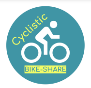

# Cyclistic Bike-share: A Case Study
### -Cedrick C. Sante

*Datasets used is from [Divvy Bikes](https://divvy-tripdata.s3.amazonaws.com/index.html), the ones from July 2021 to June 2022, under this [license](https://ride.divvybikes.com/data-license-agreement).*

*[R](https://cran.r-project.org/mirrors.html) with [RStudio IDE](https://www.rstudio.com/products/rstudio/download/#download) recommended to run the R notebook (.Rmd file). This can also run in [RStudio Cloud](rstudio.cloud).*

*This project was done as part of Google Data Analytics Capstone.*

 

 

-A case study of a fictional bike-rental company, though data is taken from actual business. I've analyzed a combination of 12 sets of data, as to find differences from casual bike riders and annual-subscribing members. This is also intended to help in persuading those casual users to avail the annual subscription, as it's significantly more profitable.

Tools used include **MS Excel** for simple data manipulation, and mainly **R** for actual analysis and visualization. Feel free to check out the **Roadmap** and **Slideshow Presentation** included in this folder or through this links: 
  - [Roadmap](https://docs.google.com/document/d/1NrP-5rhY4dA5hN4HwWCeGP3eWc6mn--nZiTXk4OFl_s/edit?usp=sharing)
  - [Slideshow](https://docs.google.com/presentation/d/1PDHf-yU1aZB1BqKPXKldaiuFnZTV0EwI6rUIFHyTny8/edit?usp=sharing)

-Analysis process is also documented in an **R notebook** (.Rmd file), along with a *knitted* HTML file of it.

Thank you!
